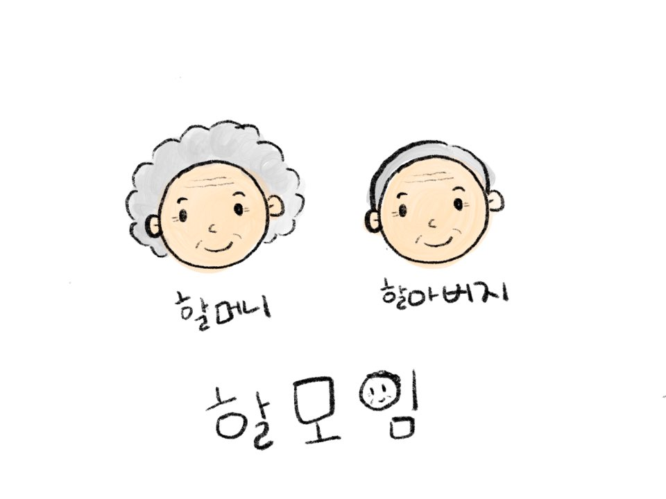

# 시니어를 위한 모임, 친구 만들기 서비스


## 프로젝트 설명

- 활동적인 노후생활을 추구하며, 미디어 활용능력이 좋은 액티브 시니어들이 
  가까운 거리를 기반으로 모임이나 친구를 만들 수 있도록 돕는 플랫폼


#### 기능

- 회원가입/로그인
- 모임 기능
- 친구 기능
- 채팅 기능
- 내 정보페이지


#### 와이어 프레임

- [WireFrame](readme/wireframe.md)


## 할모임 사용법

### 깃랩에서 클론하기

```
$ git clone https://lab.ssafy.com/s02-final/s02p31a107.git
```

### Zip파일 다운로드하기

```
$ wget https://lab.ssafy.com/s02-final/s02p31a107/-/archive/master/s02p31a107-master.zip -O halmoim.zip; unzip halmoim.zip; rm halmoim.zip
```

## Front 

- 프로그램을 시작하는데 필요한 모듈 목록이 포함 된 `package.json`

- 종속성을 설치하려면 다음을 실행

```
npm install
```

- 프로그램을 실행하려면 다음 명령어
- http://localhost:3000 포트 3000번으로 실행되어 다음 링크를 따라 확인

```
npm start
```

- material-ui 설치

```
$ npm install @material-ui/core
```

## Back

#### 라이브러리 설치하기

- 객체와 Entity에 필요한 Lombok 설치
  - 설치방법: https://duzi077.tistory.com/142

#### API 확인

https://localhost:8080/api/swagger-ui.html


### 시스템 구조도

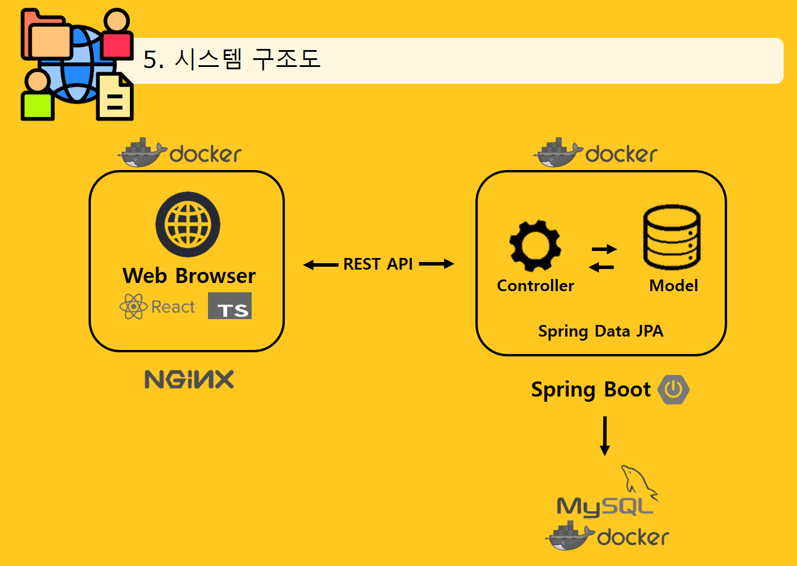


### 데이터베이스 ERD

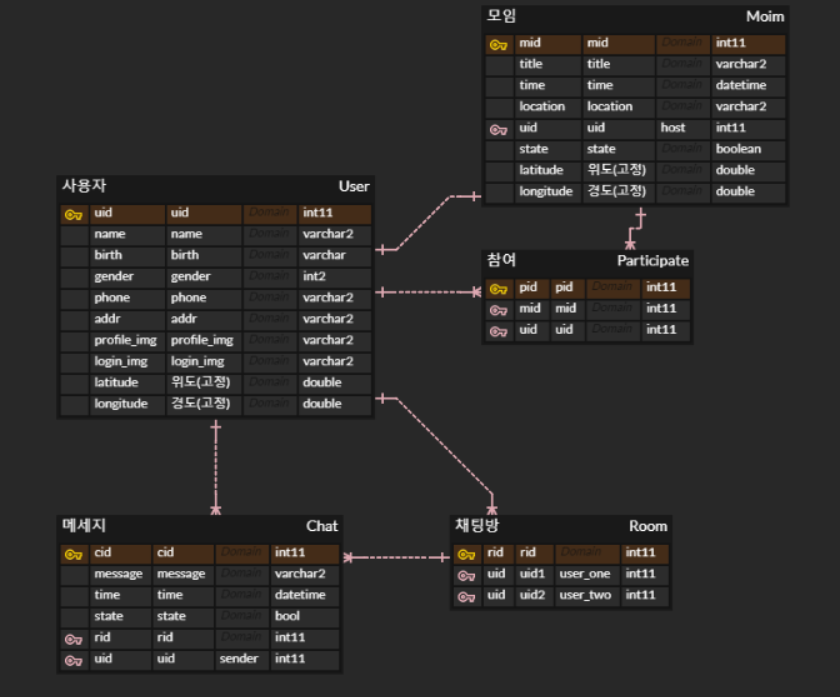


### 기획배경

- 한국 노인 자살률은 OECD국가 중 최고에 달한다.
- 그 이유 중 하나가 외로움으로 인한 우울증이며
  이러한 노인분들의 외로움을 달래줄 만남 어플을 기획
- **의문점** : <span style="color:red">노인분들의 미디어 활용 능력 정도가 어떠한가?</span>
- =>  활동적인 노후생활 추구, 미디어 활용능력이 좋은 **Active Senior** 생겨났고, 시간이 지날수록 그 수는 더 많아질것으로 판단


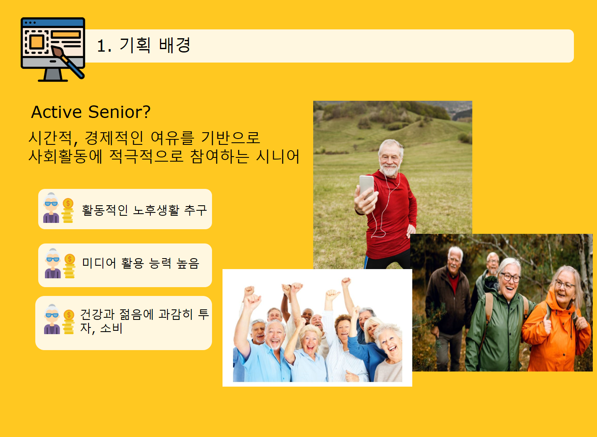


### 기능 구현

#### 회원가입 및 로그인

- 주 고객층을 고려한 차별화된 서비스 =>  **간편한 로그인**
- 잊어 버리기 쉬운 아이디, 비밀번호 => 휴대폰 번호 + **얼굴 인식**을 통한 인증 과정

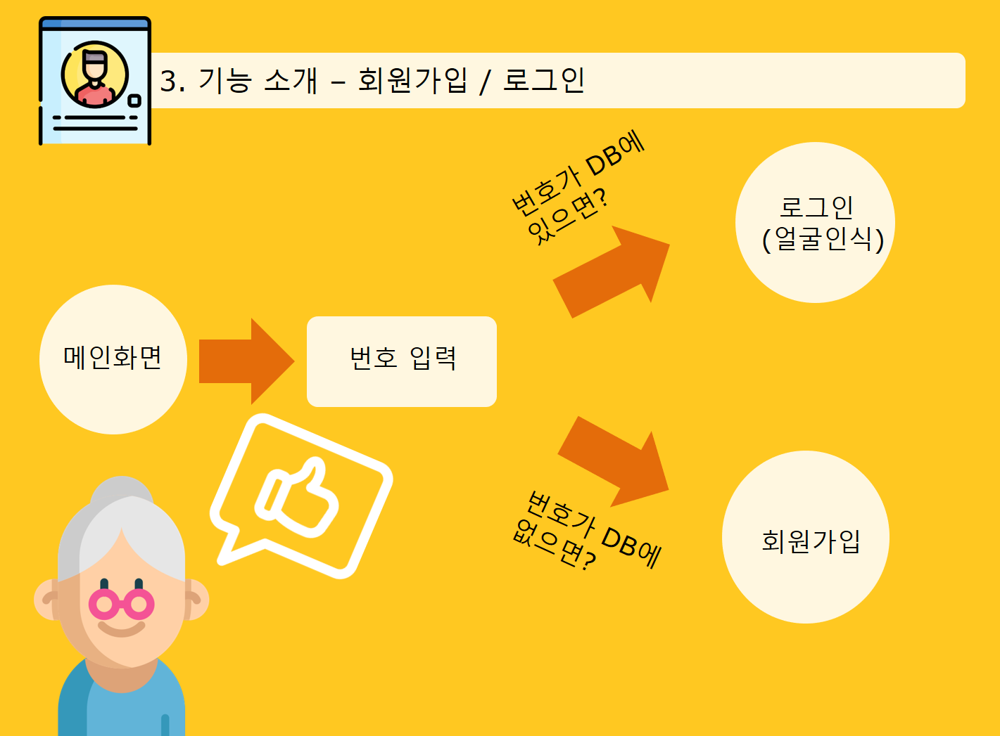

- 회원가입시 주소입력의 번거로움 => Kakao 지도 API 활용한 **현재 위치 기반의 주소 받아오기**
- 사진등록 => 로그인 시 필요한 **얼굴 사진 저장**

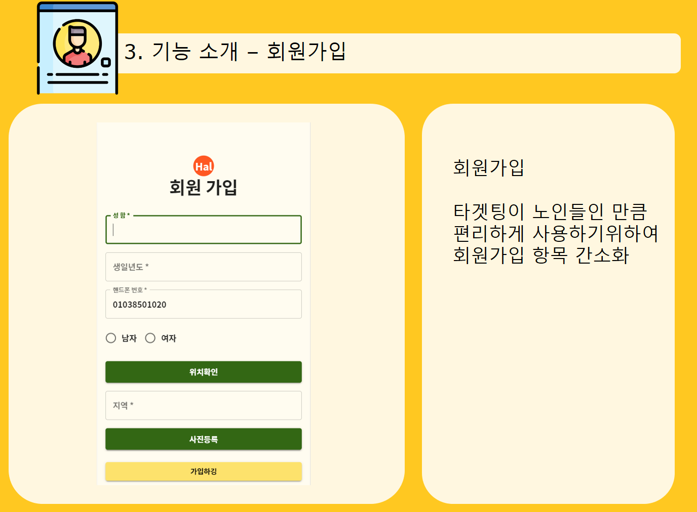

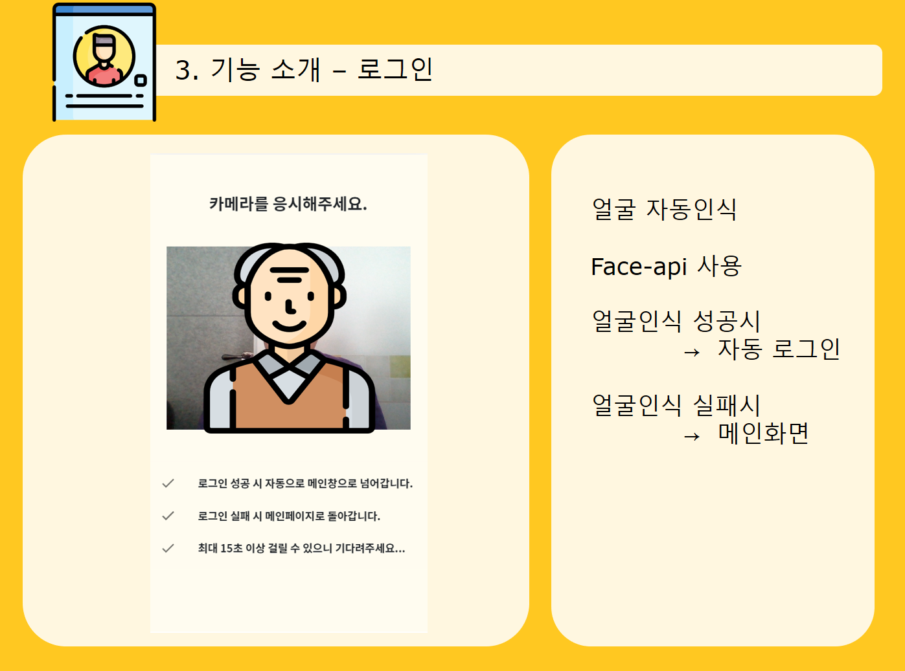


#### 모임 기능

- 주변 거리 반경 내 모임 정보 조회, 생성, 참여 기능
- 카드 뒤집기 => **주최자 정보 **조회 가능
- 참여, 취소 => 실시간 반영

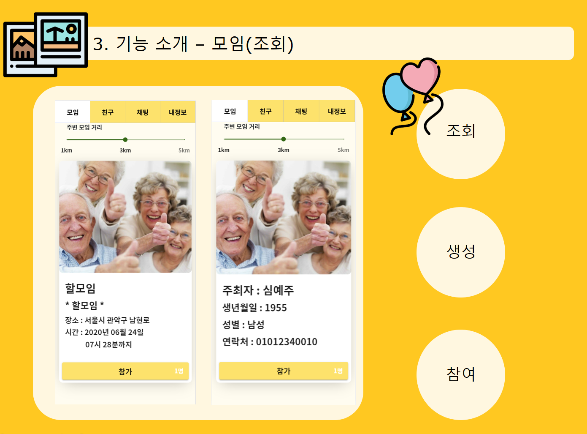

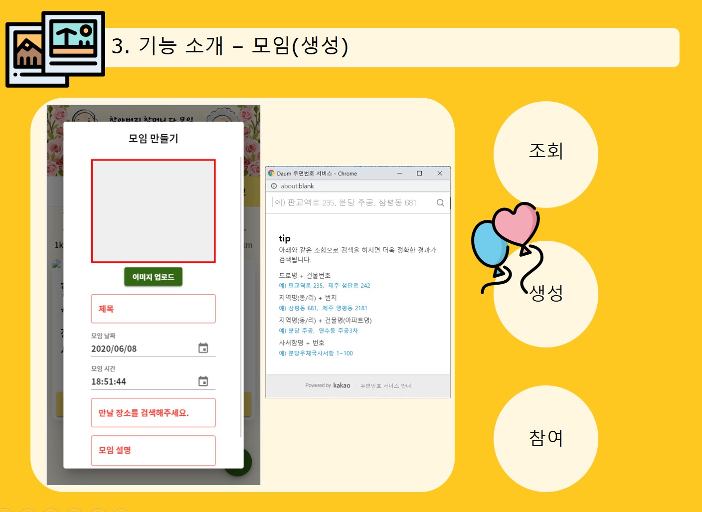

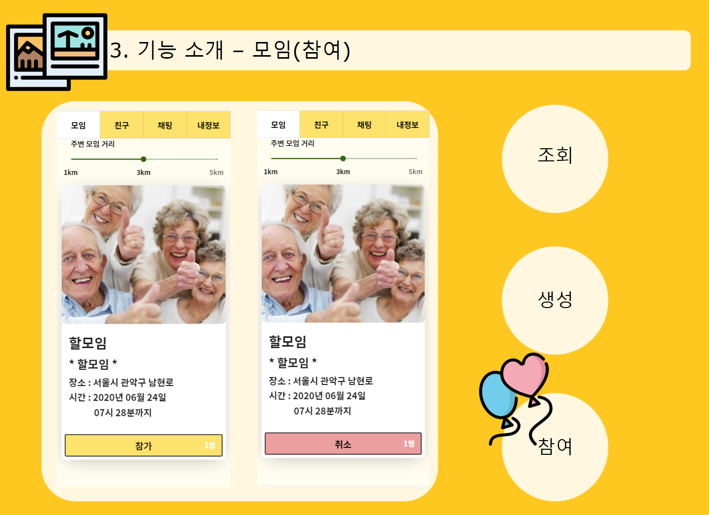


### 친구 기능

- 주변 거리 반경 내 존재하는 친구 조회
- 친구 목록 중 만남을 원하는 친구 선택시 **채팅연결**

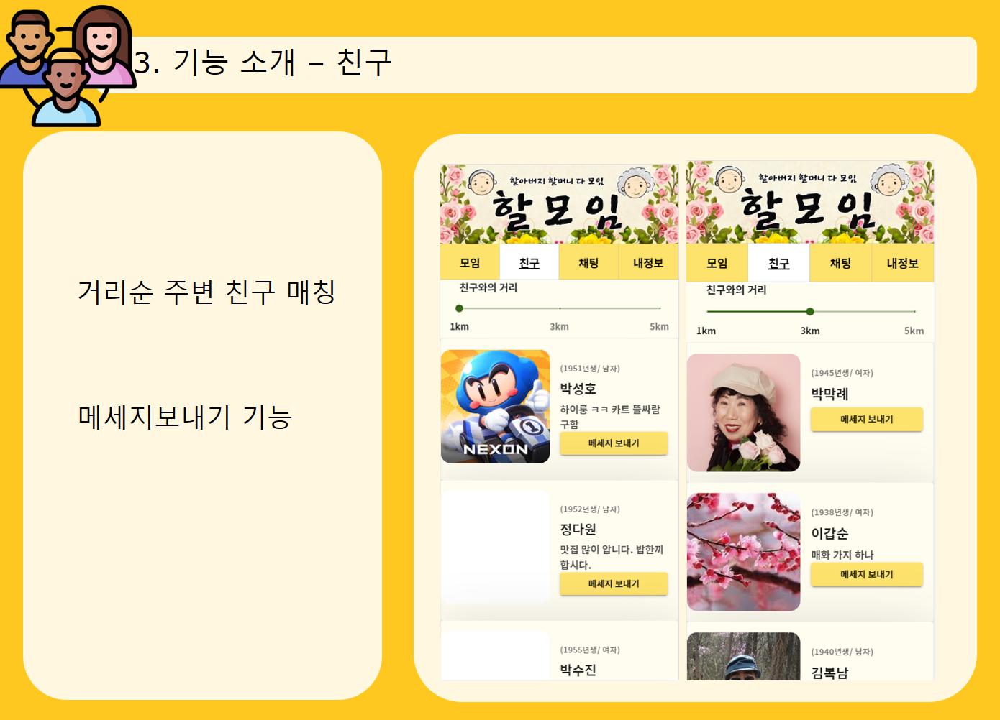


### 채팅 기능

- **WebSocket** + 텍스트 기반의 메세징 프로토콜 **STOMP** 을 활용한 채팅 기능 구현


### 내 정보 페이지

- 프로필 사진, 지역, 이름, 생년월일 등 개인 정보 수정 가능
- 내가 개설한 모임, 내가 참여한 모임 조회

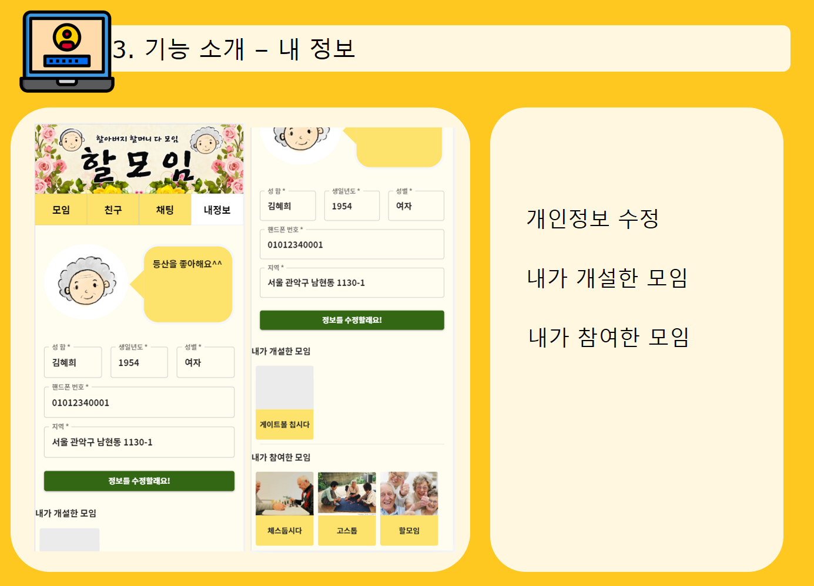

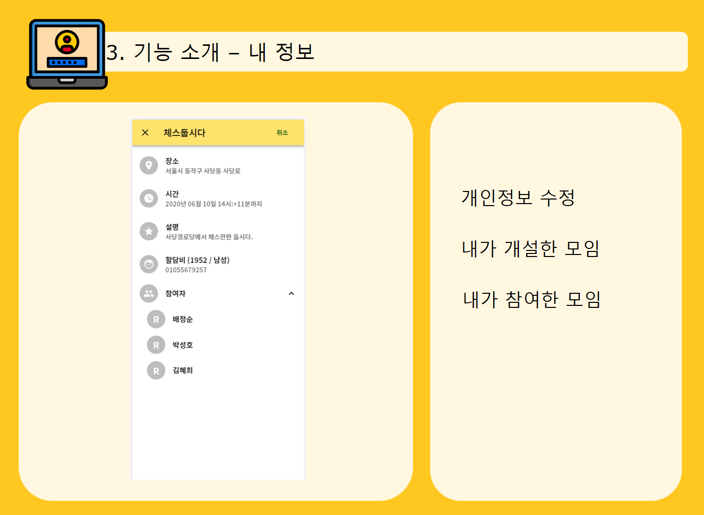

